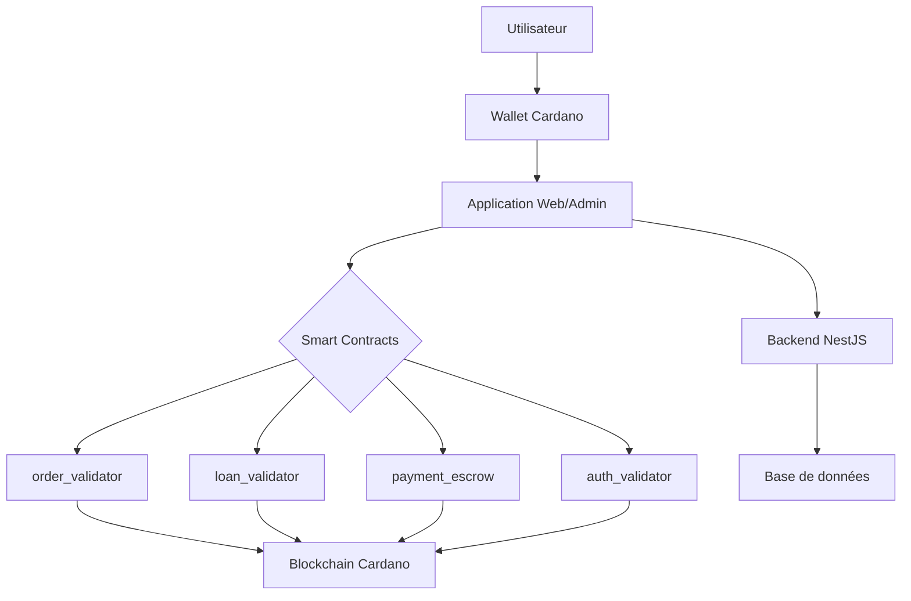
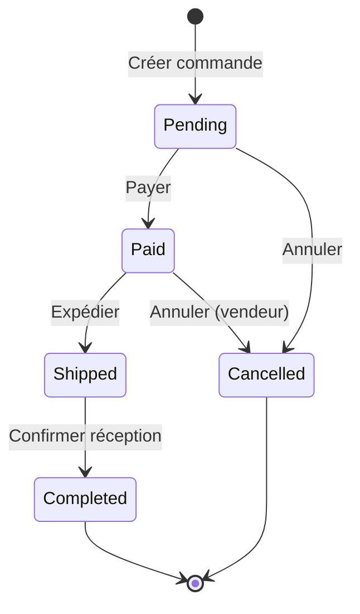
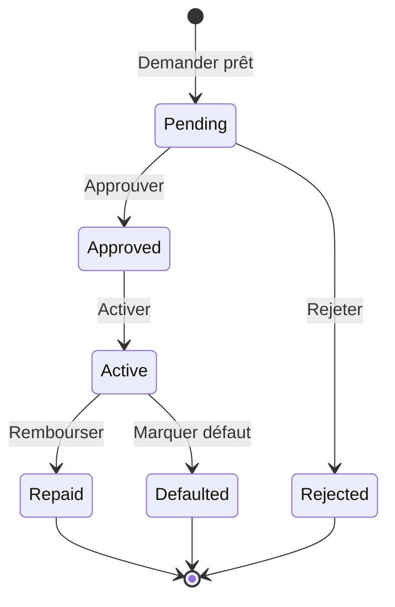
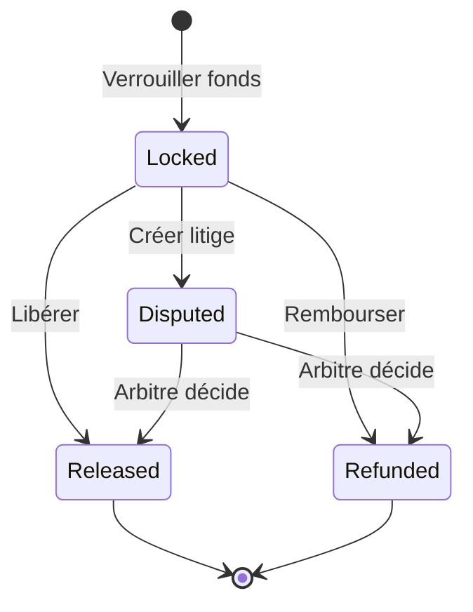

# Guide d'Utilisation des Smart Contracts MkulimaChain

Ce guide détaille l'utilisation des smart contracts Aiken pour la plateforme MkulimaChain.

## Table des Matières

1. [Vue d'ensemble](#vue-densemble)
2. [Architecture](#architecture)
3. [Order Validator](#order-validator)
4. [Loan Validator](#loan-validator)
5. [Payment Escrow](#payment-escrow)
6. [Auth Validator](#auth-validator)
7. [Intégration avec Mesh SDK](#intégration-avec-mesh-sdk)
8. [Gestion des erreurs](#gestion-des-erreurs)
9. [Calcul des frais](#calcul-des-frais)
10. [Sécurité et bonnes pratiques](#sécurité-et-bonnes-pratiques)

---

## Vue d'ensemble

MkulimaChain utilise 4 smart contracts principaux écrits en Aiken pour gérer les opérations critiques sur la blockchain Cardano :

| Contrat | Rôle | Fichier |
|---------|------|---------|
| **order_validator** | Gestion du cycle de vie des commandes | `order_validator.ak` |
| **loan_validator** | Gestion des micro-prêts DeFi | `loan_validator.ak` |
| **payment_escrow** | Paiements sécurisés en séquestre | `payment_escrow.ak` |
| **auth_validator** | Authentification et permissions | `auth_validator.ak` |

## Architecture



### Flux de données

1. **Frontend** → Initie une action (ex: payer une commande)
2. **Mesh SDK** → Construit la transaction Cardano
3. **Smart Contract** → Valide la transaction
4. **Blockchain** → Enregistre la transaction
5. **Backend** → Met à jour la base de données

---

## Order Validator

### Description

Gère le cycle de vie complet des commandes avec distribution automatique des fonds.

### États de commande



### Datum Structure

```aiken
type OrderDatum {
  buyer_address: ByteArray,
  seller_address: ByteArray,
  item_id: ByteArray,
  quantity_kg: Int,
  unit_price_lovelace: Int,
  total_lovelace: Int,
  platform_fee_percent: Int,
  platform_address: ByteArray,
  status: OrderStatus,
  created_at: Int,
}
```

### Actions disponibles

#### 1. Pay - Payer une commande

**Conditions :**
- ✅ Commande en statut `Pending`
- ✅ Acheteur signe la transaction
- ✅ Montant total > 0

**Exemple avec Mesh SDK :**

```typescript
import { MeshTxBuilder } from '@meshsdk/core';

const payOrder = async (wallet, orderDatum) => {
  const txBuilder = new MeshTxBuilder();
  
  const tx = txBuilder
    .spendingPlutusScript('v3')
    .txIn(/* UTXO avec l'order */)
    .txInScript(orderValidatorCode)
    .txInDatum(orderDatum)
    .txInRedeemer({
      action: {
        Pay: {
          payment_hash: transactionHash
        }
      }
    })
    .requiredSignerHash(buyerPubKeyHash)
    .changeAddress(wallet.getChangeAddress())
    .complete();
    
  const signedTx = await wallet.signTx(tx);
  return await wallet.submitTx(signedTx);
};
```

#### 2. Ship - Expédier une commande

**Conditions :**
- ✅ Commande en statut `Paid`
- ✅ Vendeur signe la transaction
- ✅ Numéro de suivi fourni

#### 3. Complete - Compléter et distribuer les fonds

**Conditions :**
- ✅ Commande en statut `Shipped`
- ✅ Acheteur confirme la réception
- ✅ Frais de plateforme valides (0-100%)

**Distribution des fonds :**
```typescript
const platformFee = (totalLovelace * platformFeePercent) / 100;
const sellerAmount = totalLovelace - platformFee;
```

#### 4. Cancel - Annuler une commande

**Conditions :**
- ✅ Si `Pending`: Acheteur OU Vendeur peut annuler
- ✅ Si `Paid`: Seul le Vendeur peut annuler

---

## Loan Validator

### Description

Gère les micro-prêts DeFi pour les agriculteurs avec approbation, activation et remboursement.

### États de prêt



### Datum Structure

```aiken
type LoanDatum {
  farmer_address: ByteArray,
  amount_lovelace: Int,
  interest_rate: Int,        // Base 100 (5 = 5%)
  duration_days: Int,
  start_timestamp: Int,
  due_timestamp: Int,
  lender_address: ByteArray,
  platform_address: ByteArray,
  status: LoanStatus,
  approved_by: Option<ByteArray>,
}
```

### Actions disponibles

#### 1. Approve - Approuver un prêt

**Conditions :**
- ✅ Prêt en statut `Pending`
- ✅ Plateforme signe la transaction
- ✅ Montant > 0
- ✅ Taux d'intérêt: 0-50%
- ✅ Durée > 0 jours

#### 2. Activate - Activer et débloquer les fonds

**Conditions :**
- ✅ Prêt en statut `Approved`
- ✅ Plateforme signe
- ✅ Hash de transaction fourni

#### 3. Repay - Rembourser avec intérêts

**Conditions :**
- ✅ Prêt en statut `Active`
- ✅ Fermier signe
- ✅ Montant ≥ montant attendu

**Calcul du remboursement :**
```typescript
const calculateRepayment = (amount: number, interestRate: number) => {
  return amount + (amount * interestRate) / 100;
};

// Exemple: 1000 ADA à 5% = 1050 ADA
const repayment = calculateRepayment(1000_000000, 5); // 1050000000 lovelace
```

#### 4. MarkDefaulted - Marquer en défaut

**Conditions :**
- ✅ Prêt en statut `Active`
- ✅ Plateforme signe
- ✅ Date d'échéance dépassée

#### 5. Reject - Rejeter une demande

**Conditions :**
- ✅ Prêt en statut `Pending`
- ✅ Plateforme signe
- ✅ Raison fournie

---

## Payment Escrow

### Description

Système de paiement sécurisé en séquestre avec arbitrage en cas de litige.

### États d'escrow



### Datum Structure

```aiken
type EscrowDatum {
  payer_address: ByteArray,
  beneficiary_address: ByteArray,
  amount_lovelace: Int,
  arbiter_address: ByteArray,
  deadline_timestamp: Int,
  description: ByteArray,
  status: EscrowStatus,
}
```

### Actions disponibles

#### 1. Release - Libérer les fonds

**Conditions :**
- ✅ Escrow en statut `Locked`
- ✅ Bénéficiaire OU Arbitre signe

#### 2. Refund - Rembourser le payeur

**Conditions :**
- ✅ Escrow en statut `Locked`
- ✅ Payeur OU Arbitre signe

#### 3. Dispute - Créer un litige

**Conditions :**
- ✅ Escrow en statut `Locked`
- ✅ Payeur OU Bénéficiaire signe
- ✅ Raison fournie

#### 4. ResolveDispute - Résoudre un litige

**Conditions :**
- ✅ Escrow en statut `Disputed`
- ✅ Arbitre signe
- ✅ Décision valide

**Types de décision :**

```typescript
type DisputeDecision = 
  | { ReleaseToBeneficiary: {} }
  | { RefundToPayer: {} }
  | { Split: { beneficiary_percent: number } };

// Exemple: Partage 70/30
const decision = {
  Split: { beneficiary_percent: 70 }
};
```

---

## Auth Validator

### Description

Authentification et gestion des permissions basées sur les rôles.

### Datum Structure

```aiken
type AuthDatum {
  user_address: ByteArray,
  role: UserRole,
  registered_at: Int,
  is_active: Bool,
  metadata_hash: Option<ByteArray>,
}

type UserRole {
  Farmer
  Buyer
  Admin
  Platform
}
```

### Actions disponibles

#### 1. Register - Enregistrer un utilisateur

**Conditions :**
- ✅ Utilisateur signe
- ✅ Signature fournie
- ✅ Pas déjà actif

#### 2. Verify - Vérifier une action signée

**Conditions :**
- ✅ Utilisateur actif
- ✅ Utilisateur signe
- ✅ Hash d'action fourni

#### 3. Deactivate - Désactiver un compte

**Conditions :**
- ✅ Utilisateur se désactive lui-même OU
- ✅ Admin/Plateforme désactive

#### 4. UpdateRole - Changer le rôle

**Conditions :**
- ✅ Admin/Plateforme signe
- ✅ Nouveau rôle valide

---

## Intégration avec Mesh SDK

### Installation

```bash
npm install @meshsdk/core @meshsdk/core-cst @meshsdk/core-csl
```

### Configuration

```typescript
import { MeshWallet, BlockfrostProvider } from '@meshsdk/core';

const blockchainProvider = new BlockfrostProvider(
  process.env.NEXT_PUBLIC_BLOCKFROST_API_KEY!
);

// Charger le code compilé des contrats
const orderValidatorCode = process.env.NEXT_PUBLIC_ORDER_VALIDATOR_CODE!;
const loanValidatorCode = process.env.NEXT_PUBLIC_LOAN_VALIDATOR_CODE!;
const escrowValidatorCode = process.env.NEXT_PUBLIC_ESCROW_VALIDATOR_CODE!;
const authValidatorCode = process.env.NEXT_PUBLIC_AUTH_VALIDATOR_CODE!;
```

### Exemple complet: Payer une commande

```typescript
import { MeshTxBuilder, serializePlutusScript } from '@meshsdk/core';

export const payOrderOnChain = async (
  wallet: MeshWallet,
  orderId: string,
  orderDatum: OrderDatum,
  utxo: UTxO
) => {
  const buyerAddress = await wallet.getChangeAddress();
  const txBuilder = new MeshTxBuilder();
  
  // Construire la transaction
  const unsignedTx = await txBuilder
    .spendingPlutusScript('v3')
    .txIn(
      utxo.input.txHash,
      utxo.input.outputIndex,
      utxo.output.amount,
      utxo.output.address
    )
    .txInScript(orderValidatorCode)
    .txInDatum(JSON.stringify(orderDatum))
    .txInRedeemer({
      data: {
        action: {
          Pay: {
            payment_hash: orderId
          }
        }
      }
    })
    .requiredSignerHash(extractPubKeyHash(buyerAddress))
    .changeAddress(buyerAddress)
    .selectUtxosFrom(await wallet.getUtxos())
    .complete();
  
  // Signer et soumettre
  const signedTx = await wallet.signTx(unsignedTx);
  const txHash = await wallet.submitTx(signedTx);
  
  return txHash;
};
```

---

## Gestion des erreurs

### Erreurs courantes

| Erreur | Cause | Solution |
|--------|-------|----------|
| `Script execution failed` | Validation échouée | Vérifier les conditions du contrat |
| `Insufficient funds` | Pas assez d'ADA | Ajouter des fonds au wallet |
| `Invalid datum` | Structure incorrecte | Vérifier le format du Datum |
| `Missing signature` | Signataire manquant | Ajouter `requiredSignerHash` |
| `UTxO not found` | UTXO déjà dépensé | Rafraîchir les UTxOs |

### Debugging

```typescript
try {
  const txHash = await payOrderOnChain(wallet, orderId, datum, utxo);
  console.log('Transaction réussie:', txHash);
} catch (error) {
  console.error('Erreur de transaction:', error);
  
  if (error.message.includes('Script execution failed')) {
    console.error('Validation du contrat échouée - vérifier les conditions');
  }
}
```

---

## Calcul des frais

### Frais de transaction Cardano

Les smart contracts Plutus coûtent plus cher que les transactions simples :

| Type de transaction | Frais estimés |
|---------------------|---------------|
| Transaction simple | ~0.17 ADA |
| Execution Plutus V3 | ~0.5 - 2 ADA |
| Plusieurs contrats | ~1 - 5 ADA |

### Estimation des frais

```typescript
const estimateFees = async (unsignedTx: string) => {
  // Mesh calcule automatiquement les frais
  // Vous pouvez les vérifier avant de signer
  const txBody = deserializeTransaction(unsignedTx);
  const fees = txBody.body().fee().to_str();
  console.log(`Frais estimés: ${fees} lovelace`);
  return fees;
};
```

---

## Sécurité et bonnes pratiques

### ✅ Bonnes pratiques

1. **Toujours tester sur testnet** avant le mainnet
2. **Valider les montants** avant d'envoyer
3. **Vérifier les signatures** des parties concernées
4. **Utiliser des timeouts** pour les escrows
5. **Auditer le code** des smart contracts
6. **Limiter les montants** pour les tests initiaux
7. **Monitorer les transactions** après déploiement
8. **Garder les clés privées** en sécurité

### ⚠️ À éviter

1. ❌ Déployer directement sur mainnet sans tests
2. ❌ Stocker des clés privées en clair
3. ❌ Ignorer les erreurs de validation
4. ❌ Utiliser des montants arbitraires sans vérification
5. ❌ Ne pas vérifier les signatures requises

### Checklist de sécurité

- [ ] Tests sur testnet réussis
- [ ] Audit du code des contrats
- [ ] Simulation de toutes les actions possibles
- [ ] Tests de cas limites (montants = 0, etc.)
- [ ] Vérification des calculs de distribution
- [ ] Documentation de toutes les actions
- [ ] Plan de surveillance post-déploiement

---

## Ressources

- [Documentation Aiken](https://aiken-lang.org/)
- [Documentation Mesh SDK](https://meshjs.dev/)
- [Cardano Developer Portal](https://developers.cardano.org/)
- [CIP-25 NFT Metadata](https://cips.cardano.org/cips/cip25/)

---

## Support

Pour toute question ou problème :
- Consulter la documentation complète
- Vérifier les exemples dans `/contracts/validators/`
- Tester d'abord sur testnet
- Contacter l'équipe technique MkulimaChain
